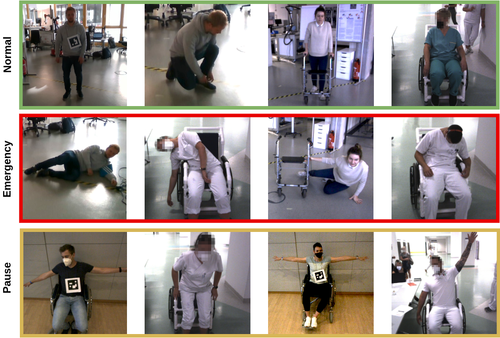

# PeTRA Dataset for Human Emergency Detection
The PeTRA dataset consists of over 18,000 single images from 200 videos as a single label, multiclass classification problem.  It is an rich training source for the use case of a moving mobile robot in a highly dynamic environment with multiple people.  

**Image dataset is not yet published. (Work in progress)  
The reduced dataset with OpenPose keypoints is uploaded here.**

## Examples


## Classes of patient transports in hospitals

| Class Name | ID | Trigger actions                                       | Reaction                         |
|------------|----|-------------------------------------------------------|---------------------------------|
| Normal     | 0  | Walking, sitting in wheelchair, everyday situations, pushing a rollator | Transport as planned             |
| Emergency  | 1  | Fall, stumbling with rollator, unconscious in wheelchair | Transport stopped and emergency call to nurse |
| Pause      | 2  | Patient too far away, standing up from wheelchair, crushing hazard | Transport paused                 |

There are three different use cases for this dataset which correspond to the transport modes of the PeTRA robot. The first transport mode is with self-walking patients only, this includes patients with rollator who can be partially obscured. This set only consists of the binary output classes "Normal" and "Emergency". The second mode is for transportation with wheelchair only and the third mode is a combination of both datasets for transports where both scenarios occur and to train a single model as comparison to the specific models trained on the separate datasets. All of the scenes are partially static and dynamic in which the robot moves in front of the person. The use-case requires a multi-person detection with tracking over frames, therefor the number of people simultaneously visible in the scene ranges from 1 to 5. There are 20 unique persons with 50 % male and female distribution. The locations differ from scenes in the laboratory with and without daylight as well as scenes from hospital floors with only artificial lightning. It was recorded with two different cameras. The first is a Roboception rc_visard 160 color which is a stereo camera with 160 mm baseline and has a color image resolution of 1280x960 at 25 Hz and a depth image resolution of 640x480 with a range from 0.5 m to infinity. The second camera is a RealSense D415 which is also a stereo camera with 55 mm baseline, color image resolution of 1920x1080 at 30 Hz and depth image resolution of 640x480 with a range from 0.5 m to 3 m. 

## Distribution of the data

| Class Name | ID | Walking | Wheelchair | Combined | % |
| --- | --- | --- | --- | --- | --- |
| Normal | 0 | 7,864 | 4,704 | 12,568 | 68\% |
| Emergency | 1 | 2,550 | 980 | 3,530 | 19\% |
| Pause | 2 | 0 | 2,304 | 2,304 | 13\% |
| $\Sigma$ | | 10,414 | 7,988 | 18,402 | 100\% |

Detailed labels with 22 classes were created manually. These include different stages of falling and specific everyday situations. The final output classes relevant for emergency detection are derived from these labels. For testing 5618 (31 %) images are used. The other part is used for training with a 5-fold cross validation. The dataset split is made on video level, so that no image from the same video is in both sets. The test set also contains videos of people who do not appear in the training set. A reduced version without the original images, but with all the keypoints from OpenPose and corresponding depth data, already filtered by the relevant patient can be found here to be used by other researchers. The PeTRA dataset is released under the CC BY-NC 4.0 license.

## Evaluation

Based on this dataset an SVM was trained and compared to other models and [AutoML](https://github.com/automl/auto-sklearn)

| Application | Model name | Recall | F1-score |
| --- | --- | --- | --- |
| Walking | SVM | 0.958 | 0.822 |
|  | MLP\_thresh | 0.937 | 0.865 |
|  | RF\_thresh | 0.928 | 0.854 |
|  | AutoML\_30 | 0.918 | 0.882 |
| Combined | SVM\_thresh | 0.847 | 0.778 |
|  | MLP\_thresh | 0.774 | 0.772 |
|  | RF\_thresh | 0.720 | 0.738 |
|  | AutoML\_25200 | 0.707 | 0.752 |
| Wheelchair | SVM\_thresh | 0.622 | 0.672 |
|  | MLP\_thresh | 0.414 | 0.540 |
|  | AutoML\_30 | 0.381 | 0.536 |
|  | RF | 0.170 | 0.289 |

## Publications

If you use this dataset in scientific publications, please use this citation.
```
@inproceedings{zachariae-etal-conf-ias-year,
    author = {Zachariae, Andreas and Widera, Julia and Hein, Bj{\"o}rn and Wurll, Christian},
    title = {Human Emergency Detection During Autonomous Hospital Transports},
    booktitle = {Proceedings of The 18th International Conference on Intelligent Autonomous Systems},
    year = {2023}
}
```

## License

<a rel="license" href="http://creativecommons.org/licenses/by-nc/4.0/"></a><br />This work is licensed under a <a rel="license" href="http://creativecommons.org/licenses/by-nc/4.0/">Creative Commons Attribution-NonCommercial 4.0 International License</a>.
